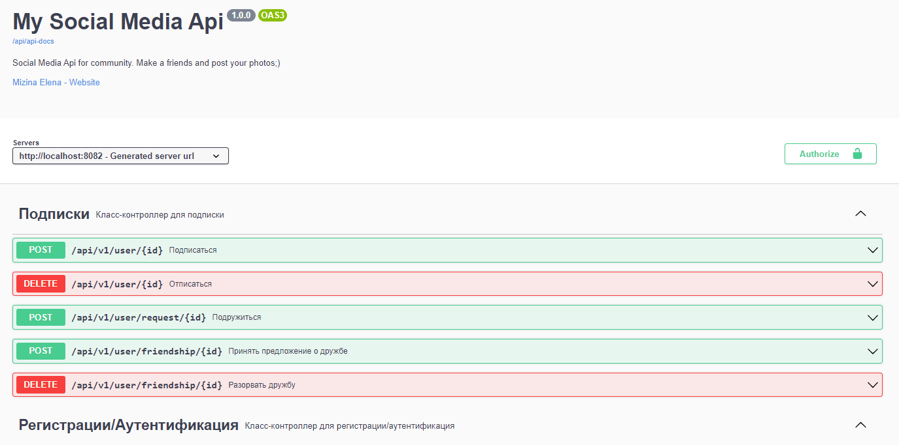

 ## Введение
____
 Это RESTful API для социальной медиа платформы. Пользователи могут зарегистрироваться, входить в систему, создавать посты, обмениваться сообщениями, подписываться на других пользователей и видеть ленту активности. 
## Как развернуть API
____
- [X] Скачайте zip проекта или склонируйте к себе
- [X] Выполните команда  ```mvn install ```
- [X] API будет доступно по ссылке ```http://localhost:8082/api/```
## Документация
____
За документацией обратитесь по ссылке [SWAGER](http://localhost:8082/api/swagger-ui/index.html)


## Авторизация
____
Все запросы API требуют использования сгенерированного токена API. Вы можете получить свой токен, перейдя к конечной точке /login и введя логин и пароль.

Пример запроса

    GET /api/auth/login

```
    {
    "username": "test",
    "password": 123
    }
```
#### Регистрация
Если вы еще не зарегестррованы в системе, то обратитесь по адресу
    
    GET /api/auth/register


```
    {
     "email": "test@mail.ru,
     "username": "test",
     "password": 123
    }
```

#### Возможные ошибки
| Код ошибки | Текст ошибки |
|:---------:|:---------:|
| 400 | Имя пользователя уже занято!  |
| 400 | Email уже используется! |

